# Terraform Azure Infrastructure with GitHub Actions

This repository contains Terraform configurations for deploying infrastructure to Microsoft Azure, with automated deployment using GitHub Actions. It supports both basic infrastructure deployment and advanced VM-to-Scale-Set workflows for custom image creation and auto-scaling applications.

## 🏗️ Complete Workflow Architecture

```mermaid
flowchart TD
    Start([Developer Starts]) --> Decision{Choose Workflow Type}
    
    %% Core Infrastructure Path
    Decision -->|Basic Infrastructure| CorePath[Core Infrastructure Workflow]
    CorePath --> CoreSecrets{GitHub Secrets Set?}
    CoreSecrets -->|No| SetCoreSecrets[Set Required Secrets:<br/>- AZURE_CLIENT_ID<br/>- AZURE_CLIENT_SECRET<br/>- AZURE_TENANT_ID<br/>- AZURE_SUBSCRIPTION_ID]
    SetCoreSecrets --> CoreSecrets
    CoreSecrets -->|Yes| CoreDeploy[terraform-deploy.yml]
    
    CoreDeploy --> CoreTerraform[Deploy Core Infrastructure:<br/>- Resource Group<br/>- Storage Account<br/>- Terraform State Backend]
    CoreTerraform --> CoreComplete([✅ Basic Infrastructure Ready])
    
    %% VM Image Creation Path
    Decision -->|VM Image Creation| VMPath[VM Image Creation Workflow]
    VMPath --> VMSecrets{All Secrets Set?}
    VMSecrets -->|No| SetVMSecrets[Set Additional Secrets:<br/>- VM_SSH_PRIVATE_KEY<br/>- VM_SSH_PUBLIC_KEY<br/>+ Core secrets above]
    SetVMSecrets --> VMSecrets
    VMSecrets -->|Yes| VMWorkflow[vm-image-creation.yml]
    
    VMWorkflow --> VMInputs[Workflow Inputs:<br/>📝 vm_name: template-vm<br/>📝 image_version: 1.0.0<br/>☑️ cleanup_vm: true]
    VMInputs --> VMInfra[Deploy VM Infrastructure:<br/>🏗️ Resource Group<br/>🌐 Virtual Network + Subnets<br/>🖼️ Compute Gallery<br/>💾 Storage Account<br/>🔒 Private Endpoints<br/>💻 Template VM]
    
    VMInfra --> VMReady{VM Accessible?}
    VMReady -->|No| VMWait[Wait 30s<br/>Retry SSH Connection]
    VMWait --> VMReady
    VMReady -->|Yes| AnsibleConfig[Run Ansible Configuration:<br/>📦 Install packages<br/>⚙️ Configure Nginx<br/>🔒 Setup firewall<br/>🛡️ Security hardening]
    
    AnsibleConfig --> AnsibleGeneral[Run Ansible Generalization:<br/>🗑️ Clear logs & history<br/>🔧 Remove machine-specific files<br/>☁️ Clean cloud-init artifacts<br/>📦 Package cleanup]
    
    AnsibleGeneral --> VMStop[Stop & Generalize VM:<br/>⏹️ Deallocate VM<br/>🔄 Generalize VM<br/>📸 Capture Image]
    
    VMStop --> ImageCreate[Create Image Version in Gallery:<br/>🖼️ Store in Compute Gallery<br/>🏷️ Tag with version<br/>📍 Set replica locations]
    
    ImageCreate --> CleanupDecision{Cleanup VM?}
    CleanupDecision -->|Yes| VMCleanup[🗑️ Delete Template VM<br/>Keep Gallery & Network]
    CleanupDecision -->|No| VMKeep[💾 Keep Template VM]
    VMCleanup --> VMComplete
    VMKeep --> VMComplete([✅ Custom Image Created])
    
    %% Scale Set Deployment Path
    Decision -->|Scale Set Deployment| ScaleSetPath[Scale Set Deployment]
    VMComplete --> ScaleSetPath
    ScaleSetPath --> ScaleSetSecrets{Required Secrets Set?}
    ScaleSetSecrets -->|No| SetScaleSetSecrets[Ensure SSH Keys Set:<br/>- VM_SSH_PRIVATE_KEY<br/>- VM_SSH_PUBLIC_KEY<br/>+ Core Azure secrets]
    SetScaleSetSecrets --> ScaleSetSecrets
    ScaleSetSecrets -->|Yes| ScaleSetWorkflow[vm-scale-set-deploy.yml]
    
    ScaleSetWorkflow --> ScaleSetInputs[Workflow Inputs:<br/>📝 image_version: 1.0.0<br/>📝 scale_set_name: web-scale-set<br/>📝 initial_instances: 2<br/>📝 max_instances: 10]
    
    ScaleSetInputs --> ImageExists{Custom Image Exists?}
    ImageExists -->|No| ImageError[❌ Error: Run VM Image<br/>Creation first]
    ImageExists -->|Yes| ScaleSetDeploy[Deploy Scale Set Infrastructure:<br/>🏗️ New Resource Group<br/>🌐 Production Virtual Network<br/>⚖️ Load Balancer + Public IP<br/>📊 Auto-scaling Rules<br/>🔍 Health Probes]
    
    ScaleSetDeploy --> ScaleSetInstances[Create VM Scale Set:<br/>🖼️ Using Custom Image<br/>💻 Initial Instance Count<br/>🔄 Auto-scaling Enabled<br/>🔒 User-assigned Identity]
    
    ScaleSetInstances --> HealthCheck{All Instances Healthy?}
    HealthCheck -->|No| WaitInstances[Wait 30s<br/>Check Instance Status]
    WaitInstances --> HealthCheck
    HealthCheck -->|Yes| AppTest[Test Application:<br/>🌐 Test Load Balancer IP<br/>❤️ Health endpoint check<br/>📄 Main page verification]
    
    AppTest --> ScaleSetComplete([✅ Scale Set Deployed<br/>🌐 Application Live])
    
    %% Optional Components
    ScaleSetComplete --> OptionalComponents{Add Optional<br/>Components?}
    CoreComplete --> OptionalComponents
    
    OptionalComponents -->|Yes| OptionalPath[Add Optional Modules:<br/>🗝️ Key Vault<br/>📱 App Service<br/>🗄️ SQL Database<br/>📊 Application Insights]
    OptionalComponents -->|No| FinalComplete([🎉 Deployment Complete])
    OptionalPath --> FinalComplete
    
    %% Error Handling
    ImageError --> VMPath
    
    %% Styling
    classDef startEnd fill:#e1f5fe,stroke:#01579b,stroke-width:2px
    classDef workflow fill:#f3e5f5,stroke:#4a148c,stroke-width:2px  
    classDef decision fill:#fff3e0,stroke:#e65100,stroke-width:2px
    classDef action fill:#e8f5e8,stroke:#2e7d32,stroke-width:2px
    classDef secrets fill:#ffebee,stroke:#c62828,stroke-width:2px
    classDef optional fill:#f9fbe7,stroke:#33691e,stroke-width:2px
    classDef error fill:#ffcdd2,stroke:#d32f2f,stroke-width:2px
    
    class Start,CoreComplete,VMComplete,ScaleSetComplete,FinalComplete startEnd
    class CoreDeploy,VMWorkflow,ScaleSetWorkflow workflow
    class Decision,CoreSecrets,VMSecrets,VMReady,CleanupDecision,ScaleSetSecrets,ImageExists,HealthCheck,OptionalComponents decision
    class CoreTerraform,VMInfra,AnsibleConfig,AnsibleGeneral,VMStop,ImageCreate,ScaleSetDeploy,ScaleSetInstances,AppTest action
    class SetCoreSecrets,SetVMSecrets,SetScaleSetSecrets secrets
    class OptionalPath optional
    class ImageError error
```


## Architecture Overview

### 🎯 **Workflow Types**

1. **Core Infrastructure** - Basic Azure resources (Resource Group + Storage)
2. **VM Image Creation** - Create custom VM images with Ansible configuration
3. **Scale Set Deployment** - Deploy auto-scaling applications using custom images

### 📋 **Required & Optional Variables**

#### **Core Infrastructure (Always Required)**
```yaml
# GitHub Secrets (Required)
AZURE_CLIENT_ID: "Service Principal App ID"
AZURE_CLIENT_SECRET: "Service Principal Secret"  
AZURE_TENANT_ID: "Azure Tenant ID"
AZURE_SUBSCRIPTION_ID: "Azure Subscription ID"

# Terraform Variables (Optional - has defaults)
project_name: "myproject"           # Default: "tfazure"
environment: "dev"                  # Default: "dev" 
location: "East US"                 # Default: "East US"
```

#### **VM Image Creation (Additional Requirements)**
```yaml
# GitHub Secrets (Additional Required)
VM_SSH_PRIVATE_KEY: "SSH private key content"
VM_SSH_PUBLIC_KEY: "SSH public key content"

# Workflow Inputs (Optional - has defaults)
vm_name: "template-vm"              # Default: "template-vm"
image_version: "1.0.0"              # Default: "1.0.0"
cleanup_vm: true                    # Default: true

# Ansible Variables (Configured in playbooks)
app_name: "myapp"                   # Application name
app_version: "1.0.0"                # Application version
admin_username: "azureuser"         # VM admin username
```

#### **Scale Set Deployment (Additional Requirements)**
```yaml
# Workflow Inputs (Optional - has defaults)
image_version: "1.0.0"              # Must match created image
scale_set_name: "web-scale-set"     # Default: "web-scale-set"
initial_instances: "2"              # Default: "2"
max_instances: "10"                 # Default: "10"

# Auto-scaling Configuration (Module defaults)
scale_out_cpu_threshold: 75         # Scale out when CPU > 75%
scale_in_cpu_threshold: 25          # Scale in when CPU < 25%
vm_sku: "Standard_B2s"              # VM size for scale set
health_probe_path: "/"              # Health check endpoint
```

#### **Optional Components**
```yaml
# Key Vault (when enabled)
key_vault_name: "myproject-kv"
key_vault_sku: "standard"

# App Service (when enabled) 
app_service_name: "myproject-app"
app_service_sku: "B1"
os_type: "Linux"                    # or "Windows"

# SQL Database (when enabled)
sql_server_name: "myproject-sql"
sql_database_name: "mydatabase"
sql_admin_username: "sqladmin"
```

### 🔄 **Decision Points**

| Decision Point | Options | Impact |
|----------------|---------|--------|
| **Workflow Type** | Core \| VM Image \| Scale Set | Determines resources created |
| **Cleanup VM** | true \| false | Saves costs vs keeps template |
| **Instance Count** | 1-1000 | Initial scale set size |
| **VM SKU** | B2s \| D2s_v3 \| F4s_v2 | Performance vs cost |
| **Upgrade Mode** | Manual \| Rolling \| Automatic | Update strategy |
| **Optional Modules** | Enabled \| Disabled | Additional services |

This setup includes:
- **Resource Group**: Container for all Azure resources
- **Storage Account**: For Terraform state management and general storage needs

## Prerequisites

Before using this repository, ensure you have:

1. An Azure subscription
2. A GitHub repository with the following secrets configured:
   - `AZURE_CLIENT_ID`: Azure Service Principal Application ID
   - `AZURE_CLIENT_SECRET`: Azure Service Principal Secret
   - `AZURE_SUBSCRIPTION_ID`: Your Azure Subscription ID
   - `AZURE_TENANT_ID`: Your Azure Active Directory Tenant ID

## Repository Structure

```
.
├── .github/
│   └── workflows/
│       ├── terraform-plan.yml    # PR validation workflow
│       └── terraform-deploy.yml  # Main deployment workflow
├── terraform/
│   ├── main.tf                   # Main Terraform configuration
│   ├── variables.tf              # Variable definitions
│   ├── outputs.tf                # Output definitions
│   ├── terraform.tfvars.example  # Example variables file
│   └── provider.tf               # Provider configurations
├── scripts/
│   └── setup-azure-auth.sh       # Script to create Azure Service Principal
└── README.md
```

## Setup Instructions

### 1. Fork/Clone this Repository

```bash
git clone <your-repo-url>
cd terraform-azure-github-actions
```

### 2. Create Azure Service Principal

Run the setup script or manually create a service principal:

```bash
# Using Azure CLI
az ad sp create-for-rbac --name "terraform-github-actions" --role="Contributor" --scopes="/subscriptions/YOUR_SUBSCRIPTION_ID"
```

This will output JSON with the required credentials for GitHub secrets.

### 3. Configure GitHub Secrets

In your GitHub repository, go to Settings > Secrets and variables > Actions, and add:

- `AZURE_CLIENT_ID`: The `appId` from the service principal output
- `AZURE_CLIENT_SECRET`: The `password` from the service principal output  
- `AZURE_SUBSCRIPTION_ID`: Your Azure subscription ID
- `AZURE_TENANT_ID`: The `tenant` from the service principal output

### 4. Customize Variables

Copy `terraform/terraform.tfvars.example` to `terraform/terraform.tfvars` and update the values:

```hcl
project_name = "myproject"
environment = "dev"
location = "East US"
```

### 5. Initialize and Deploy

The GitHub Actions workflow will automatically:
- Run `terraform plan` on pull requests
- Run `terraform apply` on pushes to main branch

## Manual Deployment

To deploy manually:

```bash
cd terraform
terraform init
terraform plan
terraform apply
```

## 🚀 **Quick Start Guide**

### 1. **Basic Infrastructure Setup**
```bash
# 1. Fork/Clone repository
git clone <your-repo-url>
cd terraform-azure-github-actions

# 2. Set GitHub Secrets (required)
# Go to Settings > Secrets and variables > Actions
# Add: AZURE_CLIENT_ID, AZURE_CLIENT_SECRET, AZURE_TENANT_ID, AZURE_SUBSCRIPTION_ID

# 3. Deploy basic infrastructure
# Push to main branch or use Actions > "Terraform Deploy"
```

### 2. **VM Image Creation (Optional)**
```bash
# 1. Generate SSH keys
ssh-keygen -t rsa -b 4096 -f ~/.ssh/azure_vm_key -N ""

# 2. Add SSH keys to GitHub Secrets
# VM_SSH_PRIVATE_KEY = content of ~/.ssh/azure_vm_key
# VM_SSH_PUBLIC_KEY = content of ~/.ssh/azure_vm_key.pub

# 3. Run VM Image Creation workflow
# Actions > "VM Image Creation Pipeline" > Run workflow
```

### 3. **Scale Set Deployment (Optional)**
```bash
# After VM image creation completes:
# Actions > "Deploy VM Scale Set" > Run workflow
# Use the same image_version from step 2
```

## Workflows

## Workflows

### Core Workflows (Always Available)

#### Terraform Plan (terraform-plan.yml)
- **Trigger**: Pull requests to main branch
- **Purpose**: Validates Terraform configuration
- **Actions**: Runs `terraform plan` and comments results on PR
- **Requirements**: Core Azure secrets only

#### Terraform Deploy (terraform-deploy.yml)
- **Trigger**: Pushes to main branch  
- **Purpose**: Deploys basic infrastructure
- **Actions**: Runs `terraform apply` for Resource Group + Storage
- **Requirements**: Core Azure secrets only

### Advanced Workflows (Optional - VM Features)

#### VM Image Creation (vm-image-creation.yml)
- **Trigger**: Manual workflow dispatch
- **Purpose**: Creates custom VM images with Ansible configuration
- **Duration**: ~15-20 minutes
- **Requirements**: Core secrets + SSH keys
- **Inputs**:
  - `vm_name`: Name of template VM (default: "template-vm")  
  - `image_version`: Version tag for image (default: "1.0.0")
  - `cleanup_vm`: Delete VM after imaging (default: true)
- **Outputs**: Custom image stored in Azure Compute Gallery

#### Scale Set Deployment (vm-scale-set-deploy.yml)
- **Trigger**: Manual workflow dispatch
- **Purpose**: Deploys auto-scaling web applications
- **Duration**: ~10-15 minutes  
- **Requirements**: Core secrets + SSH keys + Custom image
- **Inputs**:
  - `image_version`: Version of custom image to use
  - `scale_set_name`: Name of scale set (default: "web-scale-set")
  - `initial_instances`: Starting instance count (default: "2")
  - `max_instances`: Maximum instances (default: "10")
- **Outputs**: Load-balanced web application with auto-scaling

## Contributing

1. Create a feature branch
2. Make your changes
3. Create a pull request
4. Review the terraform plan in the PR comments
5. Merge to main to deploy

## Security Notes

- Never commit secrets or sensitive data
- Use GitHub secrets for all credentials
- Review terraform plans carefully before merging
- Consider using branch protection rules

## 📚 **Additional Resources**

### Repository Documentation
- **[VM-to-Scale-Set Guide](./README-VM-SCALESET.md)** - Comprehensive guide for VM image and scale set features
- **[Setup Guide](./SETUP-GUIDE.md)** - Step-by-step setup instructions with troubleshooting
- **[Implementation Summary](./IMPLEMENTATION-SUMMARY.md)** - Technical overview of all components
- **[Component Guide](./docs/COMPONENT_GUIDE.md)** - How to add new Azure components

### Example Configurations
- **[VM Scale Set Example](./terraform/examples/vm-scaleset-example.tf)** - Complete example usage
- **[Environment Configs](./terraform/environments/)** - Ready-to-use environment setups

### Azure Documentation
- [Azure VM Scale Sets](https://docs.microsoft.com/en-us/azure/virtual-machine-scale-sets/)
- [Azure Compute Gallery](https://docs.microsoft.com/en-us/azure/virtual-machines/shared-image-galleries)
- [Terraform Azure Provider](https://registry.terraform.io/providers/hashicorp/azurerm/latest/docs)
- [GitHub Actions for Azure](https://docs.microsoft.com/en-us/azure/developer/github/github-actions)

## Troubleshooting

### Common Issues (All Workflows)

1. **Authentication Errors**: Verify GitHub secrets are correctly set
2. **State Lock Issues**: Check if another deployment is running
3. **Permission Errors**: Ensure service principal has correct permissions

### VM-Specific Issues

4. **SSH Connection Failures**: 
   - Check VM_SSH_PRIVATE_KEY and VM_SSH_PUBLIC_KEY secrets
   - Verify network security group rules allow SSH (port 22)
   - Ensure VM is fully provisioned before Ansible runs

5. **Image Creation Failures**:
   - VM must be deallocated before generalization
   - Check Ansible playbook execution logs
   - Verify compute gallery permissions

6. **Scale Set Deployment Issues**:
   - Custom image must exist in compute gallery first
   - Check image version matches workflow input
   - Verify load balancer health probe configuration

7. **Application Not Accessible**:
   - Check load balancer public IP assignment
   - Verify health probe endpoint returns 200 OK
   - Ensure application is running on correct port (80/443)

### Getting Help

- Check the Actions tab for detailed logs
- Review terraform plan outputs
- Consult Azure documentation for resource-specific issues
